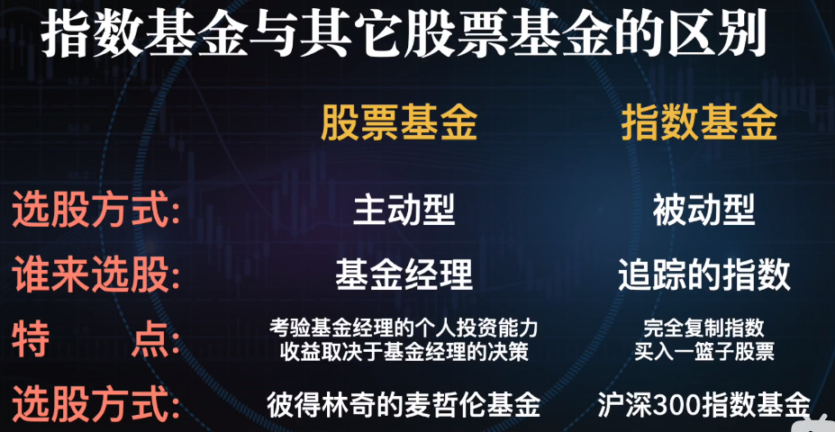
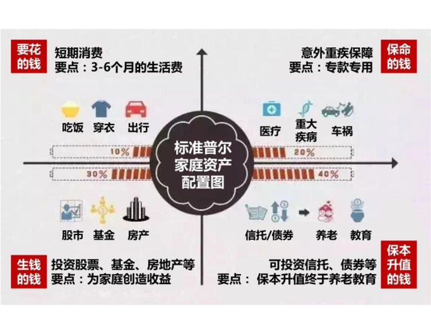
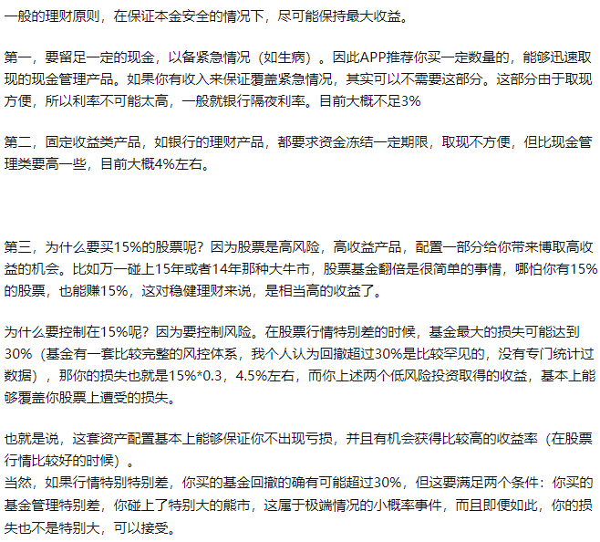

# 金融理财知识学习笔记

### 普通人能够接触到的五类资产
+ 股票类：股票、股票基金、股份制公司
+ 债权类：债券、债券基金、储蓄、银行理财
+ 货币类：货币基金、活期储蓄、逆回购
+ 房地产类：房子，房地产信托基金
+ 人力资产类：一份工作

***推荐指数基金定投***

### 普通股票基金和指数基金的区别？

### 场内交易和场外交易
+ 场内交易是在交易所买入卖出
+ 场外交易是和基金公司购买赎回

### 定投
+ 五年起不能动用的不能影响个人生活的资金
+ 先储蓄后消费

### 宽基指数和行业指数
+ 宽基指数就是大盘指数基金
+ 指的是某个具体行业的指数基金

### 分散投资
+ 鸡蛋不要放在一个篮子里
+ 并不是无脑的分散投资，高风险和低风险搭配

### 一直定投什么时候卖出呢?
+ 当长期熊市的时候人的心理压力会越来越大
+ 一般在达到自己目标收益的时候就可以及时退出了

### 估值定投/均线定投/目标定投/价值平均策略
+ 估值定投
	> 低于低估方位的时候开始买入，估值越低的时候买的越多  
	> 当估值高于低估范围时候，低于高估范围的时候，开始停止买入  
	> 当估值高于高估范围的时候，开始卖出  
	> 问题是无法合理估值范围，有个概念叫评估PE自行百度  
+ 均线定投
	> 一定天数范围内的收盘价格加起来计算一个平均值  
	> 指数如果比均线高了，说明市场投资热度热了，逐步卖出  
	> 指数如果比均线低了，说明市场投资热度低了，开始定投买入  
+ 目标定投
	> 此类方式和所投基金的自身估值投资价值的优劣无关，和投资者自身的资产情况有关  
	> 比如设定10%的目标定投，只要达到目标营收就卖出，再继续涨都与我无关了  
+ 价值平均策略
	> 通过调整投资者每期的投入金额，来使投资者所持有的的总的基金的资产，在每期当中都能保持一个既定的增长速度  

### 投资建议
+ 投资实际上一种反人性的操作
+ 最简单的投资方式，就是市场大跌的时候，带着资金悄悄地入场
+ 基金公司的赚钱方式其实主要是基金管理费，稳赚不赔
+ 雪崩的时候，没有一片雪花是无辜的
+ 当菜市场的大爷大妈们都开始讨论股票的时候就是您该获利离场的时候

### 资产配置建议
[如何制定合理的资产配置的比例？](https://www.zhihu.com/question/39286008 "如何制定合理的资产配置的比例？")

+ 第一种要花的钱
	- 短期消费，3-6个月的生活费，一般放在银行活期存款、余额宝、货币基金中  
	- 这部分不追求收益，它的特性决定了它的收益天花板（一般在3%左右），流动性是关键，最重要的是可以随存随取  
	- 这部分资产最好控制家庭资产的10%左右  
+ 第二种保障的钱
	- 这是一个杠杆账户，里面放的是保命的钱，为的就是以小博大  
	- 每个健康的家庭都需要一个能用小投入，在遇到意外、大病等极端情况时，有大回报来救急的资产，那就是保险  
	- 主要是防止因病致贫和因病返贫，因为社会阶层，向上流动的门越来越窄，但向下流动的门却永远打开着  
	- 这部分资产一般占家庭收入的10%-20%  
+ 第三种生钱的钱
	- 这种的重点是收益，用有风险的投资创造高回报
	- 不要把鸡蛋放在一个篮子里，多渠道投资分散风险，这块的配置主要有：股票、基金、房产等  
	- 关键在于合理的占比，也就是要赚得起也要亏得起，无论盈亏对家庭不能有致命性的打击  
	- 投资不是投机，建议大家选择熟悉的领域，运用专业知识赚钱！ 这部分的投资要做到：“不懂不投”  
	- 这部分资产一般占家庭资产的30%左右  
+ 第四种保本升值的钱
	- 这部分的重点是保证长期收益，是为保障家庭成员的养老金、子女教育、留给子女的钱等  
	- 要保证本金不能有任何损失，并在此基础上实现抵御通货膨胀，做到保值升值，收益不一定高，但要长期是稳定的  
	- 建议投资产品：银行理财、智能存款、信托、债券基金等  
	- 这部分资产一般占家庭资产的40%左右 
	
+ 当然每个家庭的收支不同、风险偏好不同、对未来的预期不同等都会导致规划不同，不一定非得机械的生搬硬套  
+ 适合自己的，才是最好的资产配置方案
+ 配置方案案例
	- 日常的零用钱，也就是要花的钱，我放在了民营银行的活期存款里  
	- 给自己和家人都配置了保险，花了接近3万块  
	- 保值升值的钱大部分都放在了智能存款里  
	- 用来生钱的钱，也就是创造收益的钱，我放在了指数基金里面  

### 理财的基本底线
